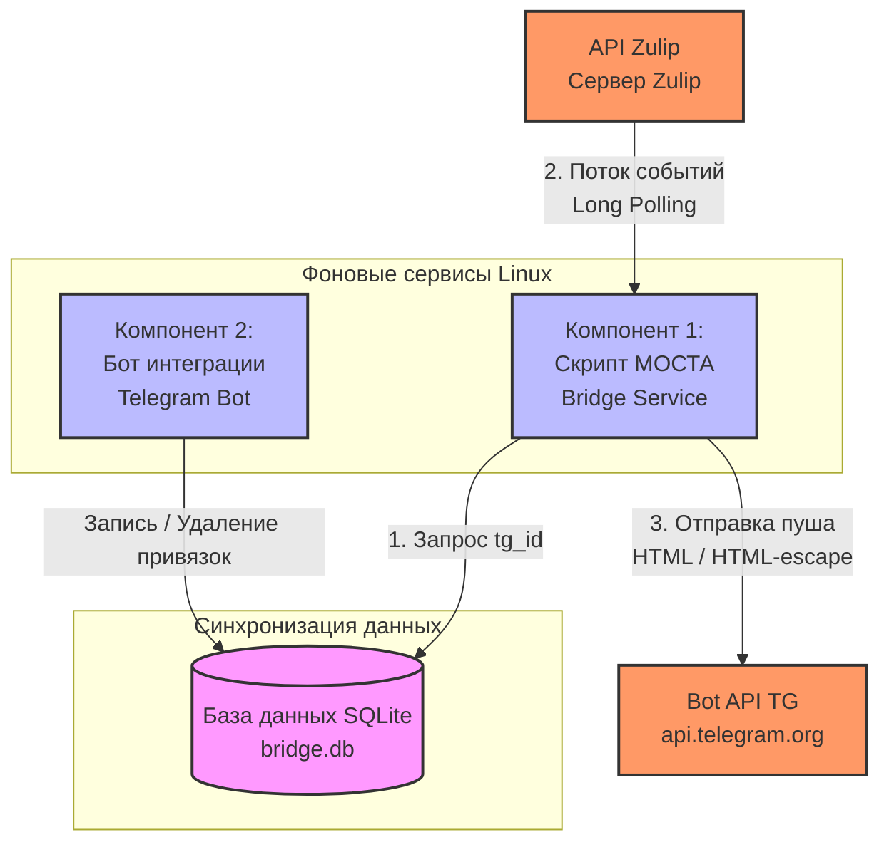

# zulip-push-service

### Архитектура приложения

```mermaid
graph TD
    %% Стилизация компонентов
    classDef db fill:#f9f,stroke:#333,stroke-width:2px;
    classDef service fill:#bbf,stroke:#333,stroke-width:2px;
    classDef api fill:#f96,stroke:#333,stroke-width:2px;

    %% Определение узлов
    DB[(База данных SQLite<br>bridge.db)]:::db
    
    BRIDGE[Компонент 1:<br>Скрипт МОСТА<br>Bridge Service]:::service
    BOT[Компонент 2:<br>Бот интеграции<br>Telegram Bot]:::service
    
    ZULIP_API[API Zulip<br>Сервер Zulip]:::api
    TG_API[Bot API TG<br>api.telegram.org]:::api

    %% Связи компонентов
    BRIDGE -->|1. Запрос tg_id| DB
    BOT -->|Запись / Удаление привязок| DB
    
    ZULIP_API -->|2. Поток событий<br>Long Polling| BRIDGE
    BRIDGE -->|3. Отправка пуша<br>HTML / HTML-escape| TG_API

    %% Расположение подзаголовков (опционально)
    subgraph Синхронизация данных
        DB
    end
    subgraph Фоновые сервисы Linux
        BRIDGE
        BOT
    end
```

